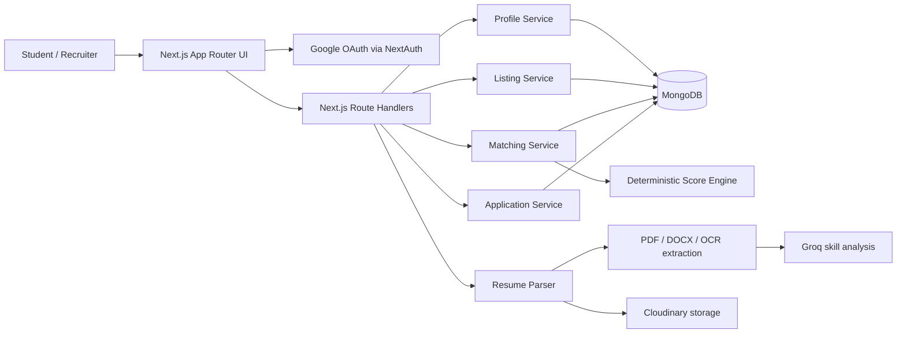

<div align="center">
  

  # CredX — Smart Job Matching Dashboard

  **Ranked opportunities. Visible reasons. Better career decisions.**

  CredX is a full-stack, explainable job and internship matching platform that turns a student's skills, GPA, and work-authorization status into ranked recommendations—and shows exactly why every role matched.

  [View the live application](https://cred-x-smart-job-matching-dash.vercel.app/) · [See the presentation](#project-presentation) · [Explore the product](#product-walkthrough) · [Understand the algorithm](#how-the-matching-engine-works) · [Run locally](#run-credx-locally)

  [](https://cred-x-smart-job-matching-dash.vercel.app/)

  
  
  
  
  
</div>


## Why CredX exists

Traditional job boards return filtered lists. Students still have to guess which roles fit, why they fit, and whether constraints such as GPA or sponsorship will disqualify them later.

CredX replaces that uncertainty with a transparent recommendation loop:

1. A student creates a structured profile or uploads a resume.
2. CredX compares the profile with every available role.
3. A deterministic scoring engine ranks the opportunities.
4. Every result includes the evidence behind its score.
5. Students apply and track progress while recruiters manage the same pipeline.

> **Core product decision:** matching logic is intentionally rule-based and explainable. A judge, student, or recruiter can reproduce the score instead of trusting an opaque black box.

## Live deployment

CredX is deployed on Vercel and available for evaluation:

### **[Launch CredX →](https://cred-x-smart-job-matching-dash.vercel.app/)**

The deployed application demonstrates the responsive landing page, Google authentication flow, student matching experience, application tracking, and recruiter workspace described below.

## Evaluation criteria, covered

| What evaluators look for | How CredX demonstrates it |
| --- | --- |
| Sensible match-score logic | Weighted skills, GPA, and work-authorization signals with an explicit incompatibility cap |
| End-to-end functionality | Profile creation → resume analysis → ranked matches → application → recruiter status update |
| Clear recommendations | Percentage score, matched skills, GPA fit, and work-auth compatibility are visible per role |
| Useful filters | Location, work mode, and sponsorship filters refine an already-ranked result set |
| Code and API quality | Typed domain modules, service boundaries, REST route handlers, reusable UI components, and unit-tested scoring |
| Stretch functionality | Resume intelligence, application tracking, recruiter workspace, explain-the-match details, sorting by score |

## Product walkthrough

### Student experience

- **Google sign-in** with a purpose-built authentication and sign-out flow.
- **Structured profile creation** for tagged skills, GPA, preferred location, and work authorization.
- **Resume intelligence** for PDF, DOCX, PNG, JPEG, and WebP files up to 5 MB.
- **Ranked match dashboard** with transparent score breakdowns.
- **Search and filters** for location, remote/hybrid/onsite work, and sponsorship.
- **Job detail and application flow** with duplicate-application protection.
- **Application tracker** for submitted, under-review, accepted, and rejected states.

### Recruiter experience

- **Recruiter dashboard** summarizing listings and applicant activity.
- **Structured role creation** with required skills, minimum GPA, location, work mode, and sponsorship.
- **Listing management** for active opportunities.
- **Applicant pipeline** with student context and calculated match scores.
- **Status management** that immediately updates the student's tracker.

### Resume intelligence pipeline

CredX validates the real file signature—not only the filename—then chooses the appropriate extraction path:

| Format | Extraction method |
| --- | --- |
| PDF | `pdf-parse` text extraction |
| DOCX | `mammoth` raw-text extraction |
| PNG / JPEG / WebP | Tesseract OCR |

Extracted text is sent to Groq with structured JSON output and `temperature: 0`. The service attempts a primary model and a fallback model, normalizes and deduplicates skills, and limits the result to 50 suggestions. If AI analysis is temporarily unavailable, the resume remains stored and the UI reports the partial success clearly.

## How the matching engine works

CredX calculates three independent signals and combines them into a score from 0–100.

```text
Final score = (Skill overlap × 0.60)
            + (GPA fit       × 0.25)
            + (Work auth     × 0.15)
```

### 1. Skill overlap — 60%

Skills use Jaccard similarity so the score rewards shared skills without ignoring missing requirements:

```text
Skill score = |student skills ∩ required skills|
              ────────────────────────────────── × 100
              |student skills ∪ required skills|
```

### 2. GPA fit — 25%

- At or above the role's minimum GPA: **100 points**.
- Below the threshold: a linear decay across one GPA point.
- More than one point below: **0 points** for this signal.

### 3. Work authorization — 15%

- Compatible authorization: **100 points**.
- Sponsorship required but not offered: **0 points**.
- Incompatible results are capped at **20 overall**, preventing an otherwise strong skill match from hiding a critical constraint while keeping the near-match visible.

### Worked example

| Signal | Result | Weight | Contribution |
| --- | ---: | ---: | ---: |
| Skill overlap | 80 | 60% | 48 |
| GPA fit | 100 | 25% | 25 |
| Work authorization | Compatible | 15% | 15 |
| **Final match** |  |  | **88%** |

The response also carries `matchedSkills`, `skillScore`, `gpaScore`, and `workAuthCompatible`, allowing the interface to explain the recommendation rather than displaying a number alone.

## System architecture



The application is a **single full-stack Next.js project**: React Server Components and client components provide the frontend, while route handlers and domain services provide the backend.

## Technology choices

| Layer | Technology | Why it is used |
| --- | --- | --- |
| Full-stack framework | Next.js 16, React 19 | App Router, server rendering, route handlers, and unified deployment |
| Language | TypeScript | Typed contracts across UI, APIs, services, and models |
| Styling | Tailwind CSS 4, shadcn/ui | Consistent, reusable, responsive interface system |
| Authentication | NextAuth.js + Google OAuth | Secure session-based user onboarding |
| Database | MongoDB + Mongoose | Flexible documents for profiles, listings, matches, and applications |
| Resume processing | pdf-parse, Mammoth, Tesseract.js | Native support for PDF, DOCX, and image resumes |
| AI analysis | Groq SDK | Fast structured extraction of skills from resume text |
| File storage | Cloudinary | Persistent resume storage |
| Testing | Vitest + fast-check | Unit and property-based verification of matching rules |

## Run CredX locally

### Prerequisites

- Node.js 20+
- npm
- MongoDB database
- Google OAuth credentials
- Groq API key
- Cloudinary account

### 1. Clone and install

```bash
git clone https://github.com/eren2yeager/credx-smartjobmatchingdash.git
cd credx-smartjobmatchingdash
npm install
```

> Install packages once in the repository root—the directory containing `package.json`.

### 2. Configure the environment

Create **`.env` in the repository root**. The seed command explicitly reads this filename.

```env
MONGODB_URI="mongodb_connection_string"

NEXTAUTH_SECRET="a_long_random_secret"
NEXTAUTH_URL="http://localhost:3000"

GOOGLE_CLIENT_ID="google_oauth_client_id"
GOOGLE_CLIENT_SECRET="google_oauth_client_secret"

CLOUDINARY_CLOUD_NAME="cloudinary_cloud_name"
CLOUDINARY_API_KEY="cloudinary_api_key"
CLOUDINARY_API_SECRET="cloudinary_api_secret"

GROQ_API_KEY="groq_api_key"

# Use the deployed URL in production for canonical SEO links.
NEXT_PUBLIC_SITE_URL="http://localhost:3000"
```

For Google OAuth, add this local callback URL in Google Cloud Console:

```text
http://localhost:3000/api/auth/callback/google
```

### 3. Seed realistic demo roles

```bash
npm run seed
```

The idempotent seed inserts 16 listings across frontend, backend, data, ML, DevOps, cloud, and internship roles. Running it again skips existing title/company pairs.

### 4. Start the application

```bash
npm run dev
```

Open [http://localhost:3000](http://localhost:3000).

### 5. Verify the project

```bash
npm run lint
npx vitest run
npm run build
```

## Recommended evaluator demo

This sequence demonstrates the complete product in approximately three minutes:

1. **Landing page** — introduce CredX as explainable matching, not another job filter.
2. **Sign in** — authenticate with Google.
3. **Student profile** — add skills, GPA, location, and work authorization; optionally upload a resume.
4. **Matches** — show score-ranked roles and explain one score using its skill, GPA, and authorization breakdown.
5. **Filters** — narrow results by work mode, location, or sponsorship without losing ranking quality.
6. **Apply** — submit an application and open the student application tracker.
7. **Recruiter workspace** — create/open a listing, review the matched applicant, and change the application status.
8. **Student tracker** — show the updated status completing the end-to-end loop.

## API surface

| Endpoint | Methods | Responsibility |
| --- | --- | --- |
| `/api/auth/[...nextauth]` | GET, POST | Google sign-in, callback, sign-out, and session handling |
| `/api/profile` | GET, POST, PATCH | Student profile creation and updates |
| `/api/resume-parse` | POST | Validate, extract, store, and analyze a resume |
| `/api/listings` | GET, POST | Retrieve/filter listings and create recruiter listings |
| `/api/match` | GET | Return ranked, explainable matches for the signed-in student |
| `/api/applications` | GET, POST, PATCH | Apply, list applications, and update pipeline status |

## Project structure

```text
src/
├── app/                     # Pages, layouts, API routes, SEO and UX states
│   ├── api/                 # Backend route handlers
│   ├── auth/                # Sign-in and sign-out experiences
│   ├── student/             # Profile, matches, job details, applications
│   └── recruiter/           # Dashboard, listings, applicants
├── components/              # Shared product and UI components
├── lib/                     # Auth, database, storage, site configuration
└── modules/
    ├── applications/        # Application model and service
    ├── listings/            # Listing model and service
    ├── matching/            # Score engine, service, model, tests
    ├── profile/             # Student profile model and service
    ├── resume/              # Validation, extraction, OCR, Groq analysis
    └── user/                # User model
```

## Design and reliability details

- Responsive student and recruiter experiences with reusable visual primitives.
- Loading skeletons, empty states, global error recovery, and a branded 404 page.
- Keyboard skip navigation, semantic landmarks, live status announcements, and reduced-motion support.
- File-size, MIME type, extension, and binary-signature validation for resume uploads.
- Server-side authentication and role-aware route access.
- SEO metadata, Open Graph data, JSON-LD, sitemap, robots policy, and PWA manifest.
- Deterministic matching tests covering boundaries and invariants.

## Project presentation

For a visual explanation of the problem, product journey, matching algorithm, system architecture, student experience, and recruiter workflow, open the complete CredX presentation:

### **[View the presentation online →](https://view.officeapps.live.com/op/view.aspx?src=https%3A%2F%2Fraw.githubusercontent.com%2FEren2yeager%2FCredX-SmartJobMatchingDash%2Fmaster%2Foutput%2FCredX_Project_Presentation.pptx)**

[Open the PowerPoint on GitHub](https://github.com/Eren2yeager/CredX-SmartJobMatchingDash/blob/master/output/CredX_Project_Presentation.pptx) · [Download the original `.pptx`](output/CredX_Project_Presentation.pptx?raw=1)

> GitHub does not display PowerPoint slides directly in every browser. Use **View the presentation online** for an in-browser slideshow, or download the original file from GitHub.

## Explore the working product

The live application is the most reliable way to evaluate the complete experience, from authentication and profile creation to explainable matching and application tracking:

**[Open the deployed CredX application →](https://cred-x-smart-job-matching-dash.vercel.app/)**

---

<div align="center">
  <strong>CredX</strong><br />
  Explainable matching that helps students act with confidence and recruiters find stronger signals.
</div>
# CredX-SmartJobMatchingDash-master

