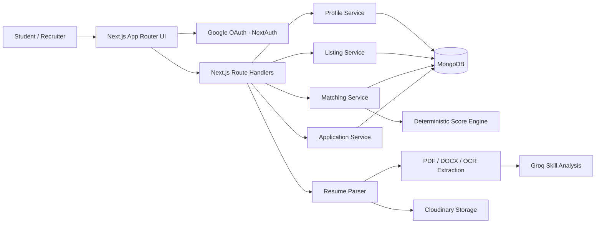

<div align="center">


# CredX — Smart Job Matching Dashboard

### Ranked opportunities. Visible reasons. Better career decisions.

CredX is a full-stack, explainable job and internship matching platform that turns a student's skills, GPA, and work-authorization status into ranked recommendations — and shows exactly *why* every role matched.

<br />

[](https://cred-x-smart-job-matching-dash.vercel.app/)
[](https://view.officeapps.live.com/op/view.aspx?src=https%3A%2F%2Fraw.githubusercontent.com%2FEren2yeager%2FCredX-SmartJobMatchingDash%2Fmaster%2Foutput%2FCredX_Project_Presentation.pptx)

<br />


</div>

<br />


<br />

---

## 📌 Table of Contents

- [Why CredX](#-why-credx)
- [Live Deployment](#-live-deployment)
- [Product Walkthrough](#-product-walkthrough)
- [Matching Engine](#-how-the-matching-engine-works)
- [System Architecture](#-system-architecture)
- [Tech Stack](#-tech-stack)
- [Project Structure](#-project-structure)
- [API Surface](#-api-surface)
- [Run Locally](#-run-credx-locally)
- [Evaluation Criteria](#-evaluation-criteria-covered)
- [Presentation](#-project-presentation)

---

## 💡 Why CredX

Traditional job boards return filtered lists. Students still have to *guess* which roles fit, why they fit, and whether constraints like GPA or sponsorship will disqualify them later.

CredX replaces that uncertainty with a **transparent recommendation loop:**

```
1. Student creates a structured profile or uploads a resume
2. CredX compares the profile against every available role
3. A deterministic scoring engine ranks all opportunities
4. Every result shows the evidence behind its score
5. Students apply and track progress — recruiters manage the same pipeline
```

> **Core product decision:** matching logic is intentionally rule-based and explainable. A judge, student, or recruiter can reproduce any score instead of trusting an opaque black box.

---

## 🚀 Live Deployment

CredX is deployed on Vercel and ready for evaluation:

<div align="center">

### **[🔗 Launch CredX →](https://cred-x-smart-job-matching-dash.vercel.app/)**

*Demonstrates: responsive landing page · Google OAuth · student matching · application tracking · recruiter workspace*

</div>

---

## 🖥️ Product Walkthrough

### 👩‍🎓 Student Experience

| Feature | Description |
|---|---|
| 🔐 Google Sign-In | Purpose-built authentication and sign-out flow |
| 📋 Profile Builder | Tagged skills, GPA, preferred location, work authorization |
| 📄 Resume Intelligence | Upload PDF, DOCX, PNG, JPEG, or WebP (up to 5 MB) |
| 🎯 Ranked Matches | Score-ranked opportunities with transparent breakdowns |
| 🔍 Search & Filters | Filter by location, work mode (remote/hybrid/onsite), sponsorship |
| 📝 Apply | One-click application with duplicate-application protection |
| 📊 Application Tracker | Track submitted → under review → accepted / rejected |

### 🏢 Recruiter Experience

| Feature | Description |
|---|---|
| 📈 Dashboard | Summary of listings and applicant activity |
| ➕ Role Creation | Skills required, min GPA, location, work mode, sponsorship |
| 📂 Listing Management | View and manage all active opportunities |
| 👥 Applicant Pipeline | Student context + calculated match scores per applicant |
| ✅ Status Management | Update status — instantly reflected in the student tracker |

### 🧠 Resume Intelligence Pipeline

CredX validates the real file signature — not just the filename — before processing:

| Format | Extraction Method |
|---|---|
| PDF | `pdf-parse` text extraction |
| DOCX | `mammoth` raw-text extraction |
| PNG / JPEG / WebP | Tesseract OCR |

Extracted text is sent to **Groq** with structured JSON output at `temperature: 0`. The service attempts a primary model with a fallback, normalizes and deduplicates skills, and caps results at 50 suggestions. If AI analysis is temporarily unavailable, the resume is still stored and the UI reports partial success clearly.

---

## ⚙️ How the Matching Engine Works

CredX calculates three independent signals and combines them into a score from **0–100**:

```
Final Score = (Skill Overlap × 0.60)
            + (GPA Fit       × 0.25)
            + (Work Auth     × 0.15)
```

### 1️⃣ Skill Overlap — 60%

Uses **Jaccard similarity** to reward shared skills without hiding missing requirements:

```
Skill Score =    |student skills ∩ required skills|
              ──────────────────────────────────────  × 100
              |student skills ∪ required skills|
```

### 2️⃣ GPA Fit — 25%

- **At or above** minimum GPA → `100 pts`
- **Below by ≤ 1 point** → linear decay
- **Below by > 1 point** → `0 pts`

### 3️⃣ Work Authorization — 15%

- Compatible → `100 pts`
- Sponsorship required but not offered → `0 pts`
- Incompatible results are **capped at 20 overall**, keeping near-matches visible without hiding critical blockers

### 📐 Worked Example

| Signal | Result | Weight | Contribution |
|---|---:|---:|---:|
| Skill Overlap | 80 | 60% | 48 |
| GPA Fit | 100 | 25% | 25 |
| Work Authorization | ✅ Compatible | 15% | 15 |
| **Final Match Score** | | | **88 / 100** |

Each response also carries `matchedSkills`, `skillScore`, `gpaScore`, and `workAuthCompatible` — so the UI explains the recommendation rather than just showing a number.

---

## 🏗️ System Architecture



> A **single full-stack Next.js project** — React Server Components handle the frontend; route handlers and domain services handle the backend.

---

## 🛠️ Tech Stack

| Layer | Technology | Purpose |
|---|---|---|
| Framework | Next.js 16 + React 19 | App Router, SSR, route handlers, unified deploy |
| Language | TypeScript | Typed contracts across UI, APIs, services, models |
| Styling | Tailwind CSS 4 + shadcn/ui | Consistent, reusable, responsive component system |
| Auth | NextAuth.js + Google OAuth | Secure session-based user onboarding |
| Database | MongoDB + Mongoose | Flexible documents for profiles, listings, matches |
| Resume | pdf-parse + Mammoth + Tesseract.js | Native PDF, DOCX, and image resume support |
| AI Analysis | Groq SDK | Fast structured skill extraction from resume text |
| File Storage | Cloudinary | Persistent resume storage |
| Testing | Vitest + fast-check | Unit and property-based verification of matching rules |
| Animation | GSAP + Motion | Smooth UI transitions and interactions |

---

## 📁 Project Structure

```
src/
├── app/                        # Pages, layouts, API routes
│   ├── api/                    # Backend route handlers
│   │   ├── auth/               # NextAuth handler
│   │   ├── profile/            # Student profile CRUD
│   │   ├── listings/           # Job listing CRUD
│   │   ├── match/              # Ranked match results
│   │   ├── applications/       # Application pipeline
│   │   └── resume-parse/       # Resume upload + analysis
│   ├── auth/                   # Sign-in and sign-out pages
│   ├── student/                # Profile, matches, job details, tracker
│   └── recruiter/              # Dashboard, listings, applicants
│
├── components/                 # Shared UI + product components
├── lib/                        # Auth, DB, Cloudinary, site config
│
└── modules/                    # Domain logic
    ├── applications/           # Application model + service
    ├── listings/               # Listing model + service
    ├── matching/               # Score engine, service, model, tests
    ├── profile/                # Student profile model + service
    ├── resume/                 # Validation, extraction, OCR, Groq
    └── user/                   # User model
```

---

## 🔌 API Surface

| Endpoint | Methods | Responsibility |
|---|---|---|
| `/api/auth/[...nextauth]` | GET, POST | Google sign-in, callback, sign-out, session |
| `/api/profile` | GET, POST, PATCH | Profile creation and updates |
| `/api/resume-parse` | POST | Validate, extract, store, and analyze resumes |
| `/api/listings` | GET, POST | Retrieve/filter listings; create recruiter listings |
| `/api/match` | GET | Ranked, explainable matches for the signed-in student |
| `/api/applications` | GET, POST, PATCH | Apply, list, and update application status |

---

## 💻 Run CredX Locally

### Prerequisites

- **Node.js** 20+
- **MongoDB** database (local or Atlas)
- **Google OAuth** credentials
- **Groq** API key
- **Cloudinary** account

### 1. Clone & Install

```bash
git clone https://github.com/eren2yeager/credx-smartjobmatchingdash.git
cd credx-smartjobmatchingdash
npm install
```

### 2. Configure Environment

Create **`.env`** in the repository root:

```env
# Database
MONGODB_URI="your_mongodb_connection_string"

# Auth
NEXTAUTH_SECRET="a_long_random_secret"
NEXTAUTH_URL="http://localhost:3000"
GOOGLE_CLIENT_ID="your_google_client_id"
GOOGLE_CLIENT_SECRET="your_google_client_secret"

# File storage
CLOUDINARY_CLOUD_NAME="your_cloudinary_cloud_name"
CLOUDINARY_API_KEY="your_cloudinary_api_key"
CLOUDINARY_API_SECRET="your_cloudinary_api_secret"

# AI
GROQ_API_KEY="your_groq_api_key"

# Site
NEXT_PUBLIC_SITE_URL="http://localhost:3000"
```

> In Google Cloud Console, add this callback URL: `http://localhost:3000/api/auth/callback/google`

### 3. Seed Demo Data

```bash
npm run seed
```

Inserts **16 realistic listings** across frontend, backend, data, ML, DevOps, cloud, and internship roles. Idempotent — re-running skips existing entries.

### 4. Start the App

```bash
npm run dev
```

Open [http://localhost:3000](http://localhost:3000)

### 5. Verify

```bash
npm run lint
npx vitest run
npm run build
```

---

## ✅ Evaluation Criteria Covered

| Evaluator Looks For | How CredX Demonstrates It |
|---|---|
| 🧮 Sensible match-score logic | Weighted skills, GPA, and work-auth signals with an explicit incompatibility cap |
| 🔁 End-to-end functionality | Profile → resume analysis → ranked matches → apply → recruiter update |
| 💬 Clear recommendations | Percentage score, matched skills, GPA fit, and work-auth visible per role |
| 🔧 Useful filters | Location, work mode, and sponsorship filters on a ranked result set |
| 💻 Code & API quality | Typed domain modules, service boundaries, REST handlers, reusable components |
| ⭐ Stretch functionality | Resume intelligence, application tracking, recruiter workspace, score explanations |

---

## 🎯 Recommended Demo Flow (~3 minutes)

```
1. Landing page     → Introduce CredX as explainable matching, not a job filter
2. Sign in          → Authenticate with Google
3. Build profile    → Add skills, GPA, location, work auth; optionally upload resume
4. View matches     → Show ranked roles; explain one score using its breakdown
5. Use filters      → Narrow by work mode, location, or sponsorship
6. Apply            → Submit an application; open the student tracker
7. Recruiter view   → Create/open a listing; review matched applicant; update status
8. Student tracker  → Show updated status — end-to-end loop complete ✓
```

---

## 📊 Project Presentation

For a visual walkthrough of the problem, product, algorithm, architecture, and both user experiences:

<div align="center">

### **[📽️ View Presentation Online →](https://view.officeapps.live.com/op/view.aspx?src=https%3A%2F%2Fraw.githubusercontent.com%2FEren2yeager%2FCredX-SmartJobMatchingDash%2Fmaster%2Foutput%2FCredX_Project_Presentation.pptx)**

[Open on GitHub](https://github.com/Eren2yeager/CredX-SmartJobMatchingDash/blob/master/output/CredX_Project_Presentation.pptx) · [Download .pptx](output/CredX_Project_Presentation.pptx?raw=1)

> GitHub doesn't render PowerPoint in every browser. Use **View Online** for an in-browser slideshow.

</div>

---

## 🔒 Reliability & Quality Details

- ⚡ Responsive student and recruiter UX with reusable visual primitives
- 🦴 Loading skeletons, empty states, global error recovery, branded 404
- ♿ Keyboard skip navigation, semantic landmarks, live status announcements, reduced-motion support
- 🛡️ File-size, MIME type, extension, and binary-signature validation for uploads
- 🔐 Server-side authentication and role-aware route access
- 🌐 SEO metadata, Open Graph, JSON-LD, sitemap, robots policy, PWA manifest
- 🧪 Deterministic matching tests covering boundaries and invariants

---

<div align="center">


**CredX** — Explainable matching that helps students act with confidence and recruiters find stronger signals.

[](https://cred-x-smart-job-matching-dash.vercel.app/)

</div>
